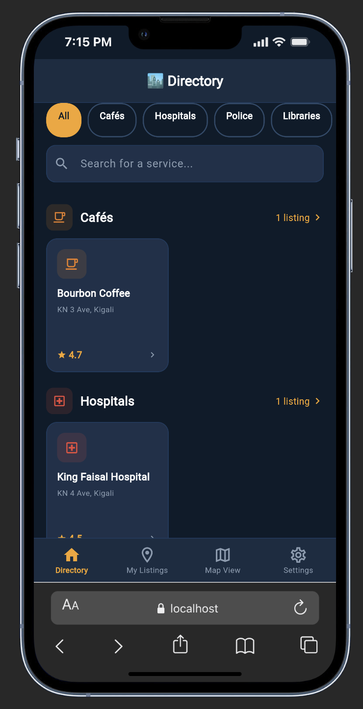
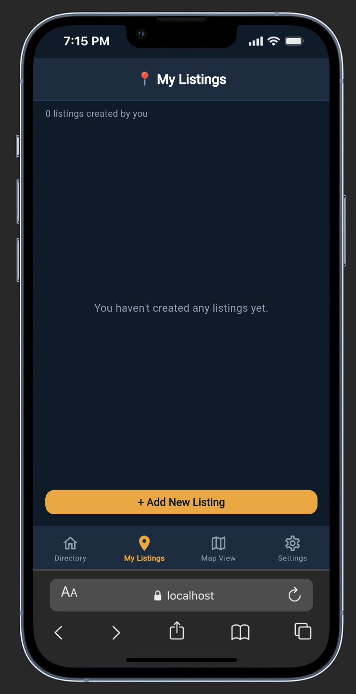
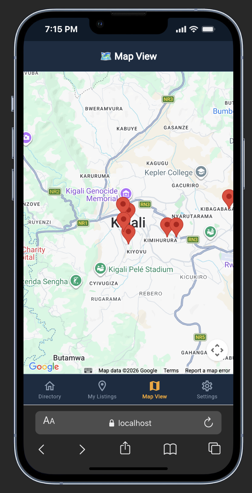
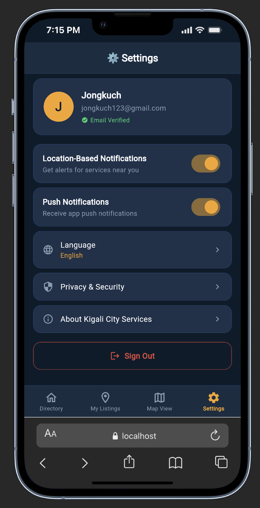

# Kigali City Services & Places Directory

A Flutter mobile application that helps Kigali residents locate and navigate to essential public services and leisure destinations — including hospitals, police stations, libraries, restaurants, cafés, parks, and tourist attractions.

Built with **Firebase Authentication**, **Cloud Firestore**, and **Google Maps Flutter**, using the **Provider** pattern for state management and a strict service-layer architecture.

---

## Features

| Feature | Details |
| --- | --- |
| Firebase Auth | Email/password sign-up, sign-in, sign-out |
| Email Verification | Enforced before app access; resend & instant check supported |
| Firestore CRUD | Create, Read, Update, Delete listings in real time |
| Real-time Updates | Directory and My Listings auto-rebuild via Firestore streams |
| Search & Filtering | Search by name; filter by category — both work simultaneously |
| Embedded Google Map | Detail page shows a marker at exact listing coordinates |
| Map View | All listings plotted on a single interactive map |
| Get Directions | Launches Google Maps / Apple Maps for turn-by-turn navigation |
| Bottom Navigation | 4 tabs: Directory · My Listings · Map View · Settings |
| Bookmarks | Save and access favourite listings (synced to Firestore) |
| Reviews | Write and browse reviews per listing |
| Settings | Authenticated user profile + notification preference toggles |
| Clean Architecture | Models → Services → Providers → UI (no Firebase calls in widgets) |

---

## Screenshots

| Login / Sign Up | Directory |
|:-:|:-:|
|  |  |

| My Listings | Map View |
|:-:|:-:|
|  |  |

| Settings |  |
|:-:|:-:|
|  | |

---

## Firestore Database Structure

### Collection: `users`

Each document is keyed by the Firebase Auth UID and is created automatically on registration.

| Field | Type | Description |
| --- | --- | --- |
| `uid` | String | Firebase Auth UID (document ID) |
| `name` | String | Display name entered at sign-up |
| `email` | String | Email address used for authentication |
| `createdAt` | Timestamp | Account creation time |

### Collection: `listings`

Auto-ID'd documents. The `createdBy` field enables user-scoped queries and is enforced by Firestore security rules.

| Field | Type | Description |
| --- | --- | --- |
| `name` | String | Place or service name |
| `category` | String | One of: `Cafés` · `Hospitals` · `Police` · `Libraries` · `Parks` · `Restaurants` · `Tourist` |
| `address` | String | Physical address in Kigali |
| `contact` | String | Phone number or contact info |
| `description` | String | Free-text description |
| `lat` | Number | Geographic latitude (decimal degrees) |
| `lng` | Number | Geographic longitude (decimal degrees) |
| `rating` | Number | Rating from 0.0 – 5.0 |
| `createdBy` | String | UID of the user who created the listing |
| `timestamp` | Timestamp | Creation time; used for ordering |

### Subcollection: `listings/{listingId}/reviews`

| Field | Type | Description |
| --- | --- | --- |
| `author` | String | Reviewer's display name |
| `text` | String | Review body text |
| `timestamp` | Timestamp | Time the review was posted |

### Bookmarks

Stored under `users/{uid}/bookmarks/{listingId}` as a Firestore subcollection for real-time per-user sync.

---

## State Management — Provider Pattern

All Firestore and Firebase Auth interactions are strictly isolated from the UI through a three-layer architecture:

```text
Firebase / Firestore  →  Service Layer  →  Provider Layer  →  UI Layer
```

### Service Layer

`AuthService` and `FirestoreService` are plain Dart classes containing all Firebase API calls. No Flutter or Provider dependencies — independently testable.

### Provider Layer

| Provider | Responsibility |
| --- | --- |
| `AuthProvider` | Auth state stream, email verification enforcement, sign-in/sign-up/sign-out, error states |
| `ListingsProvider` | Two real-time stream subscriptions (all listings + user's listings), search/filter computed properties, CRUD delegation |
| `BookmarksProvider` | Bookmark toggle and real-time sync via Firestore subcollection |

### UI Layer

Screens consume state via `Consumer<T>` or `context.watch<T>()` only. Write operations use `context.read<T>()`. **No screen file imports `firebase_auth`, `firebase_core`, or `cloud_firestore` directly.**

---

## Navigation Structure

```text
AuthScreen  (login / sign-up / email verification)
    │
    └── MainScreen  (BottomNavigationBar)
            ├── [0] DirectoryScreen     — browse all listings, search, category filter
            ├── [1] MyListingsScreen    — view / edit / delete own listings; add new
            ├── [2] MapViewScreen       — all listings as map markers
            └── [3] SettingsScreen      — user profile + notification toggles

    Detail pages (pushed on top):
            ├── DetailScreen            — full info, embedded map, directions, reviews
            ├── AddEditListingScreen    — create or edit a listing
            └── ReviewsScreen           — browse and write reviews
```

---

## Project Structure

```text
lib/
├── main.dart                       # App entry, MultiProvider setup, root auth gate
├── app_colors.dart                 # Design tokens (colours, shared constants)
├── firebase_options.dart           # Auto-generated by FlutterFire CLI
│
├── models/
│   ├── listing_model.dart          # ListingModel + ReviewModel with Firestore serialisation
│   └── user_profile_model.dart     # UserProfileModel with Firestore serialisation
│
├── services/
│   ├── auth_service.dart           # Firebase Auth wrapper (sign-up, sign-in, reload, verify)
│   └── firestore_service.dart      # Firestore streams and CRUD (listings, reviews, bookmarks)
│
├── providers/
│   ├── auth_provider.dart          # Auth state, email verification, error handling
│   ├── listings_provider.dart      # Listings CRUD, real-time streams, search/filter state
│   └── bookmarks_provider.dart     # Bookmarks state with Firestore real-time sync
│
├── screens/
│   ├── auth_screen.dart            # Login / Sign-up UI with verification banner
│   ├── main_screen.dart            # BottomNavigationBar shell (IndexedStack)
│   ├── directory_screen.dart       # Category sections + search + filter
│   ├── my_listings_screen.dart     # User's listings with Edit / Delete / Add
│   ├── map_view_screen.dart        # Google Map with all listing markers
│   ├── settings_screen.dart        # User profile card + SharedPreferences toggles
│   ├── detail_screen.dart          # Listing detail, embedded map, Get Directions, reviews
│   ├── add_edit_listing_screen.dart # Form to create or edit a listing
│   ├── bookmarks_screen.dart       # Saved listings
│   └── reviews_screen.dart         # Browse listings and write reviews
│
└── widgets/
    ├── listing_card.dart           # Reusable listing card with rating
    ├── category_badge.dart         # Animated category filter chip
    └── star_rating.dart            # Half-star capable star rating display
```

---

## Setup Instructions

### 1. Clone the repository

```bash
git clone https://github.com/Jongkuch1/kigali_services_directory.git
cd kigali_services_directory
```

### 2. Create a Firebase project

1. Go to [console.firebase.google.com](https://console.firebase.google.com)
2. Create a new project
3. Enable **Email/Password** under Authentication → Sign-in method
4. Create a **Cloud Firestore** database (start in production mode)
5. Register your Android app: `com.example.kigali_services_directory`
6. Register your iOS app: `com.example.kigaliServicesDirectory`

### 3. Connect Flutter to Firebase

```bash
dart pub global activate flutterfire_cli
flutterfire configure
```

This generates `lib/firebase_options.dart` and places `google-services.json` / `GoogleService-Info.plist` in the correct locations.

### 4. Add Google Maps API keys

Enable **Maps SDK for Android** and **Maps SDK for iOS** in [Google Cloud Console](https://console.cloud.google.com).

**Android** — edit `android/app/src/main/AndroidManifest.xml`:

```xml
<meta-data
    android:name="com.google.android.geo.API_KEY"
    android:value="YOUR_GOOGLE_MAPS_API_KEY"/>
```

**iOS** — edit `ios/Runner/AppDelegate.swift`:

```swift
import Flutter
import UIKit
import GoogleMaps

@main
@objc class AppDelegate: FlutterAppDelegate, FlutterImplicitEngineDelegate {
  override func application(
    _ application: UIApplication,
    didFinishLaunchingWithOptions launchOptions: [UIApplication.LaunchOptionsKey: Any]?
  ) -> Bool {
    GMSServices.provideAPIKey("YOUR_GOOGLE_MAPS_API_KEY")
    return super.application(application, didFinishLaunchingWithOptions: launchOptions)
  }
  func didInitializeImplicitFlutterEngine(_ engineBridge: FlutterImplicitEngineBridge) {
    GeneratedPluginRegistrant.register(with: engineBridge.pluginRegistry)
  }
}
```

### 5. Set Firestore security rules

In Firebase Console → Firestore → Rules:

```javascript
rules_version = '2';
service cloud.firestore {
  match /databases/{database}/documents {

    match /users/{uid} {
      allow read, write: if request.auth != null && request.auth.uid == uid;
    }

    match /listings/{listingId} {
      allow read: if request.auth != null;
      allow create: if request.auth != null;
      allow update, delete: if request.auth != null
        && request.auth.uid == resource.data.createdBy;
    }

    match /listings/{listingId}/reviews/{reviewId} {
      allow read: if request.auth != null;
      allow create: if request.auth != null;
    }
  }
}
```

### 6. Install dependencies and run

```bash
flutter pub get
flutter run
```

For iOS (first time):

```bash
cd ios && pod install && cd ..
flutter run
```

---

## Authentication Flow

1. User signs up with name, email, and password
2. Firebase sends a verification email automatically
3. User cannot access the app until the email is verified
4. The auth screen shows a banner with **Resend email** and **I've verified ✓** links
5. Tapping **I've verified ✓** calls `checkEmailVerified()` which reloads the Firebase user and redirects into the app instantly if verified
6. `AuthProvider.isAuthenticated` requires both `AuthStatus.authenticated` AND `emailVerified == true`

---

## Key Implementation Details

### Real-time Listings

`FirestoreService` exposes Dart `Stream`s using Firestore's `.snapshots()`. `ListingsProvider` holds two `StreamSubscription`s — one for all listings, one for the authenticated user's listings — and calls `notifyListeners()` on each emission. Every `Consumer<ListingsProvider>` in the widget tree rebuilds automatically.

### Search & Filtering

`ListingsProvider.filteredListings` is a computed getter that applies both filters simultaneously:

```dart
List<ListingModel> get filteredListings {
  return _allListings.where((l) {
    final matchesCategory =
        _selectedCategory == 'All' || l.category == _selectedCategory;
    final matchesSearch =
        l.name.toLowerCase().contains(_searchQuery.toLowerCase()) ||
        l.address.toLowerCase().contains(_searchQuery.toLowerCase());
    return matchesCategory && matchesSearch;
  }).toList();
}
```

### Map Integration

- **Detail screen**: `GoogleMap` widget centred on the listing's `lat`/`lng` with a `Marker` and `InfoWindow`. The **Get Directions** button builds a Google Maps deep-link URL and launches it via `url_launcher`, falling back to Apple Maps.
- **Map View screen**: All listings from `ListingsProvider.allListings` are converted to `Set<Marker>`. Tapping a marker's info window navigates to `DetailScreen`.

---

## Dependencies

```yaml
firebase_core: ^3.15.2
firebase_auth: ^5.7.0
cloud_firestore: ^5.6.12
provider: ^6.1.2
google_maps_flutter: ^2.9.0
url_launcher: ^6.3.2
shared_preferences: ^2.3.2
intl: ^0.20.2
```

---

## Assignment Requirements Checklist

- ✅ Firebase Authentication (sign-up, sign-in, sign-out)
- ✅ Email verification enforced before app access
- ✅ User profile stored in Firestore on registration (linked by UID)
- ✅ Firestore CRUD — Create, Read, Update, Delete listings
- ✅ All required listing fields: name, category, address, contact, description, lat, lng, createdBy, timestamp
- ✅ Real-time updates via Firestore streams + Provider
- ✅ Search by name (dynamic, case-insensitive)
- ✅ Category filtering (7 categories + All)
- ✅ Detail page with all listing information
- ✅ Embedded Google Map with marker on detail page
- ✅ Get Directions button (Google Maps / Apple Maps)
- ✅ BottomNavigationBar with 4 required tabs
- ✅ Provider state management — no Firestore calls in UI widgets
- ✅ Settings screen with user profile and notification toggle

---

## Troubleshooting

### Firebase not initialized

Run `flutterfire configure` and verify `google-services.json` is in `android/app/` and `GoogleService-Info.plist` is in `ios/Runner/`.

### Map shows as grey tiles

Verify the API key in `AndroidManifest.xml` and `AppDelegate.swift`. Confirm Maps SDK for Android/iOS is enabled in Google Cloud Console and billing is active.

### Firestore permission-denied

Update security rules in the Firebase Console as shown in Step 5 above.

### Email verification emails not arriving

Check the spam folder. In Firebase Console → Authentication → Templates, confirm the verification email template is active.

---

## Author

**Jongkuch Anyar**
[j.anyar@alustudent.com](mailto:j.anyar@alustudent.com)

Developed as Individual Assignment 2 for the Mobile Application Development course.
